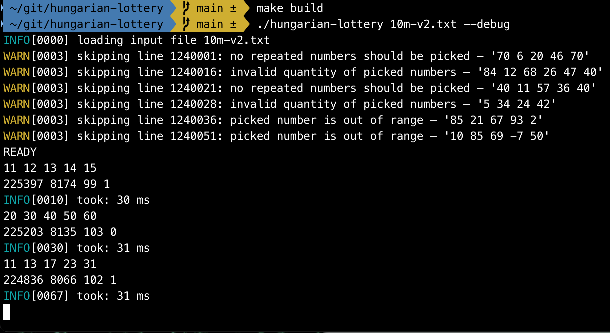

# HUNGARIAN LOTTERY

This problem is related to the Hungarian lottery. In case you are not familiar with it: players pick 5 distinct 
numbers from 1 to 90. There is a weekly lottery picking event when the lotto organization picks 5 distinct numbers 
randomly between 1 and 90 – just like the players did. A player’s reward then depends on how many of the player’s 
numbers match with the ones selected at the lotto picking. A player wins if they have 2, 3, 4 or 5 matching numbers.

## The Problem

At the lottery event, right after picking the numbers, a computer shall be able to report quickly 
that how many winners are in each category, for example:

| Numbers matching | Winners |
|------------------|---------|
| 5                | 0       |
| 4                | 12      |
| 3                | 818     |
| 2                | 22613   |

This report shall be generated as soon as possible after picking the winning numbers. The players' numbers are
known a few minutes before the show starts. In peak periods, there are currently about 10 million players.

One of the goals is to have an optimized solution that can report the results in 100ms or less.

Full specs are [here](doc/Specs.pdf).

## Running

Ensure the following requirements are met:

- go 1.23
- GNU Make

First, build the solution using:

    $ make build

If compilation is successful, it should produce a binary artifact named `hungarian-lottery` in the main folder.

You can run it passing the input file as the first argument:

    $ ./hungarian-lottery <input-file>

Optionally, the `--debug` flag can print additional information, such as processing times. Example:

    $ ./hungarian-lottery my-file.txt --debug

## Input

The input should be an ASCII text file composed of an arbitrary number of lines. Each line should represent a 
player from the lottery and should contain 5 distinct numbers that were picked by that player. The numbers must 
be separated by whitespace.

For example, these text contents represent the picks of 5 players:

```
45 81 67 78 16
29 66 14 80 41
58 67 71 32 22
63 61 46 7 16
66 46 67 13 7
```

The following criteria must be met for a line to be considered valid:

- The line must specify 5 distinct numbers.
- Numbers should range from 1 to 90, inclusive.
- The player's numbers must be distinct, i.e., the same line should not repeat any numbers.

If a line from the input file does not fit any of the above criteria, it will be SKIPPED and a warning will be
printed in the standard output.

The lottery picks should be specified in the standard input (`stdin`) in the same format, and subject to the same 
validation, followed by a new line. Example:

```
11 45 12 87 58
```

The lottery picks must only be inputted AFTER the program outputs the following line in the standard 
output (`stdout`):

```
READY
```

## Output

For each lottery pick that was inputted to the program, the output will be a line containing 4 numbers. 
The first number will be total count of players with 2 wins, the second number will be the total number of players 
with 3 wins, and so on.

Example:

```
225397 8174 99 1
```

Translating to:


| Numbers matching | Winners |
|------------------|---------|
| 5                | 1       |
| 4                | 99      |
| 3                | 8174    |
| 2                | 225397  |

A typical program session looks like the following. In this example, the optional `--debug` flag was passed to show 
execution times.



## Solution Design

## Performance Considerations

