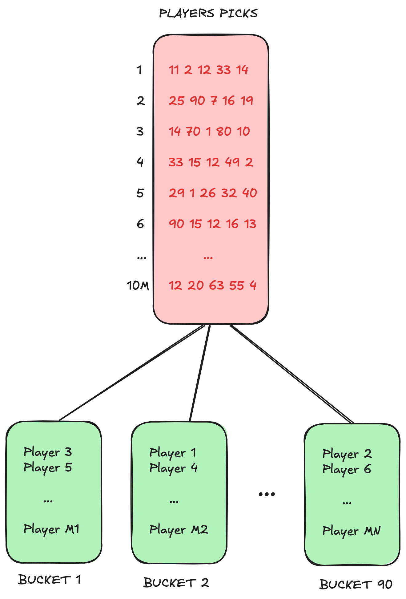

# HUNGARIAN LOTTERY

This problem is related to the Hungarian lottery. In case you are not familiar with it: players pick 5 distinct 
numbers from 1 to 90. There is a weekly lottery picking event when the lotto organization picks 5 distinct numbers 
randomly between 1 and 90 – just like the players did. A player’s reward then depends on how many of the player’s 
numbers match with the ones selected at the lotto picking. A player wins if they have 2, 3, 4 or 5 matching numbers.

## The Problem

At the lottery event, right after picking the numbers, a computer shall be able to report quickly 
that how many winners are in each category, for example:

| Numbers matching | Winners |
|------------------|---------|
| 5                | 0       |
| 4                | 12      |
| 3                | 818     |
| 2                | 22613   |

This report shall be generated as soon as possible after picking the winning numbers. The players' numbers are
known a few minutes before the show starts. In peak periods, there are currently about 10 million players.

One of the goals is to have an optimized solution that can report the results in 100ms or less.

Full specs are [here](doc/Specs.pdf).

## Running

Ensure the following requirements are met:

- go 1.23
- GNU Make

First, build the solution using:

    $ make build

If compilation is successful, it should produce a binary artifact named `hungarian-lottery` in the main folder.

You can run it passing the input file as the first argument:

    $ ./hungarian-lottery <input-file>

Optionally, the `--debug` flag can print additional information, such as processing times. Example:

    $ ./hungarian-lottery my-file.txt --debug

### Input

The input should be an ASCII text file composed of an arbitrary number of lines. Each line should represent a 
player from the lottery and should contain 5 distinct numbers that were picked by that player. The numbers must 
be separated by whitespace.

For example, these text contents represent the picks of 5 players:

```
45 81 67 78 16
29 66 14 80 41
58 67 71 32 22
63 61 46 7 16
66 46 67 13 7
```

The following criteria must be met for a line to be considered valid:

- The line must specify 5 distinct numbers.
- Numbers should range from 1 to 90, inclusive.
- The player's numbers must be distinct, i.e., the same line should not repeat any numbers.

If a line from the input file does not fit any of the above criteria, it will be SKIPPED and a warning will be
printed in the standard output.

The lottery picks should be specified in the standard input (`stdin`) in the same format, and subject to the same 
validation, followed by a new line. Example:

```
11 45 12 87 58
```

The lottery picks must only be inputted AFTER the program outputs the following line in the standard 
output (`stdout`):

```
READY
```

### Output

For each lottery pick that was inputted to the program, the output will be a line containing 4 numbers. 
The first number will be total count of players with 2 wins, the second number will be the total number of players 
with 3 wins, and so on.

Example:

```
225397 8174 99 1
```

Translating to:


| Numbers matching | Winners |
|------------------|---------|
| 5                | 1       |
| 4                | 99      |
| 3                | 8174    |
| 2                | 225397  |

A typical program session looks like the following. In this example, the optional `--debug` flag was passed to show 
execution times.


## Development Tasks

Running the unit test suite:

```
make test
```

Using code linters:

1. Install `golangci-lint` from [here](https://golangci-lint.run/welcome/install/#local-installation). This is system dependent.
2. Run `make lint`.

## Solution Design

The solution was designed with the following constraints in mind:

> ...to have an optimized solution that can report the results in 100ms or less.

and

> In peak periods, there are currently about 10 million players.

Memory constraints were not specified, therefore we optimized for CPU performance.

First, we assign each player a unique sequential numeric ID, starting from 1. These correspond roughly to the lines of
the input file. For example, `2000423`. If there are no errors in the file, this should map exactly to line 2000423. 

For efficiently retrieving the players that picked a given lottery number, we use 
[bucket-sort](https://en.wikipedia.org/wiki/Bucket_sort). We create an array with 90 buckets, where index `N-1` 
represents the bucket of lottery number `N`. This bucket should store the IDs of all players that picked number `N`, 
regardless of the order that it was picked.



As the input file is parsed, the player picks are stored into these buckets. For performance reasons, we traverse the 
file twice, once to determine the necessary array allocations, and another to store the player picks. This is in order
to avoid wasteful resizing of arrays and inefficient data copy that happen during slice appends, when the capacity of 
the array is not known beforehand.

```go
buckets := make([]uint8, 90)
for i := 0; i < len(buckets); i++ {
	buckets[i] = make([]int32, 0, allocation[i])
}
```

When the lottery picks are given in the input, we retrieve 5 buckets corresponding to these numbers. For example:

```
11 45 12 87 58
```

which map to the following:

```go
buckets[10]
buckets[44]
buckets[11]
buckets[86]
buckets[57]
```

Since the goal is to determine the total number of wins for different categories, we must find the intersections
between the 5 buckets that were picked by the lottery. By counting how many distinct player IDs intersect among these 
buckets, we can easily reach to the problem solution.

### Performance Considerations

One naive approach to find these intersections would be using a hash map. Traverse all the buckets, adding each 
player ID as key to a hash map. The values would count how many times the player IDs appear.

```go
matches := make(map[int32]int32, 10000000)
for _, pick := range picks {
	for _, playerID := range buckets[pick-1] {
		matches[playerID] += 1	
    }
}
```

However, this was not performant under 100ms. In my local benchmarks, finding the solution took ~ 450ms 
(your mileage may vary). While hash maps are memory efficient data structures, and have a theoretical 
_O(1)_ access time, in practice there is some significant overhead that becomes apparent when dealing with 10 million
of entries.

Since memory consumption was not a concern that was mentioned in the specs, we can extrapolate a little. I have replaced
the hash map with a sparse array, where the index of the array corresponds to the player ID. The array is sparse because
for most players, there will be zero wins. We are only interested in those players that have 2 or more wins. 

```go
matches := make([]int32, 10000000)
for _, pick := range picks {
	for _, playerID := range buckets[pick-1] {
		matches[playerID-1] += 1
    }
}
```

Because accessing the index of an array is significantly more performant than accessing the key of a hash map, I was
able to implement a solution that performs under ~ 30ms. Much better than the previous ~ 450ms. Again, your mileage 
may vary.

For reference, the machine used to run these benchmarks was:

```
MacBook Pro (Retina, 15-inch, Mid 2015)
2.5 GHz Quad-Core Intel Core i7
16 GB 1600 MHz DDR3
```

The only drawback is that much more memory is used now. For 10 million players, and considering the `int32` type, this
sparse array consumes 40MB of RAM, most of it being empty. It is not very much by modern standards, but it may pose a
challenge if the number of players reach the billions.

#### Scaling to Billions of Players

The solution was designed for 10 million players, and it performs using a mix of bucket sort and sparse array 
techniques.

Since sparse arrays consume a significant portion of memory, the first challenge is having enough RAM to account for it. 
The sparse array used to store 2 Billion Players would consume 8GB alone, and you must double that usage to account for 
the buckets too. However, while a bit aggressive, this is still pretty much doable by modern standards.

The biggest challenge is to traverse the 90 buckets efficiently in order to build the sparse array, then traverse the 
sparse array again in order to consolidate the lottery results.

One strategy we haven't explored yet, but could easily be applied here would be leveraging multiple threads. Modern CPUs
have limited clocks, but may accommodate several cores. Some datacenters have servers with hundreds of CPUs.

Go is a perfect language for multithreading, since goroutines are known for being 
[lightweight threads](https://medium.com/@mail2rajeevshukla/unlocking-the-power-of-goroutines-understanding-gos-lightweight-concurrency-model-3775f8e696b0). 
They have a very small overhead compared to traditional threads in other languages.

We could have 5 threads, one for each bucket picked by the lottery. We would consolidate the results into the 
sparse array, in parallel. Then again, the array could be broken into smaller chunks and counted, also 
in parallel by many goroutines.

We must be careful, however, to prevent race conditions between threads. We should avoid or minimize the use of mutexes, 
which can be very costly. The solution should be designed cleverly, and use [channels](https://gobyexample.com/channels)
to consolidate the data in a serial manner.

The Map-Reduce pattern is a great fit here. Break a large data set into smaller chunks (Map), process them in parallel, 
then consolidate the results of the computation (Reduce).
